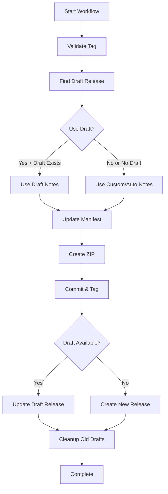

# GitHub Workflows Guide

This guide explains how to use the GitHub workflows in this repository for release management, including how to properly tag issues and pull requests to ensure they appear correctly in release notes.

## Table of Contents

- [Overview](#overview)
- [Workflows](#workflows)
  - [Release Drafter](#release-drafter)
  - [Create Release](#create-release)
  - [Create Pre-release](#create-prerelease)
- [Issue and Pull Request Labeling](#issue-and-pull-request-labeling)
- [Release Process](#release-process)
- [Best Practices](#best-practices)
- [Troubleshooting](#troubleshooting)

## Overview

This repository uses automated workflows to manage releases and generate release notes. The system consists of three main workflows:

1. **Release Drafter** - Automatically creates and updates draft releases
2. **Create Release** - Publishes final releases
3. **Create Pre-release** - Creates pre-release versions for testing

## Workflows

### Release Drafter

**Triggers:** Automatically runs on:
- Push to `main` or `master` branch
- Pull request events (opened, reopened, synchronize)

**What it does:**
- Creates or updates a draft release
- Categorizes changes based on labels
- Generates release notes automatically
- Updates version numbers based on labels

**Output:** A draft release with formatted release notes including:
- Categorized list of changes
- Installation instructions
- Configuration guidance
- Compatibility information

### Create Release

**Trigger:** Manual workflow dispatch

**Inputs:**
- `tag` (required): Release tag (e.g., `v2.10.3`)
- `release_notes` (optional): Custom release notes (overrides draft if provided)
- `use_draft` (optional, default: true): Use existing draft release notes
- `prerelease` (optional, default: false): Mark as pre-release

**What it does:**
1. Validates tag format
2. Updates `manifest.json` version
3. Creates ZIP archive
4. Commits version changes
5. Creates git tag
6. Publishes release (using draft notes or custom notes)
7. Cleans up old draft releases

**Process Flow:**


### Create Pre-release

**Trigger:** Manual workflow dispatch

**Inputs:**
- `version_bump` (required): Type of version bump (patch/minor/major)
- `prerelease_type` (required): Pre-release type (alpha/beta/rc)

**What it does:**
1. Calculates next version based on current version
2. Adds pre-release suffix (e.g., `v2.10.4-beta.1`)
3. Calls the main release workflow with pre-release flag
4. Creates pre-release with testing warnings

## Issue and Pull Request Labeling

Proper labeling is crucial for automatic categorization in release notes. Here's how to label issues and pull requests:

### Categories and Labels

#### 🛠 Breaking Changes
**Labels:** `breaking-change`, `major`
**Use for:** Changes that break backward compatibility
**Examples:**
- Removing deprecated features
- Changing API interfaces
- Requiring configuration changes

#### 🚀 Features
**Labels:** `feature`, `enhancement`, `feat`, `feature request`
**Use for:** New functionality or improvements
**Examples:**
- New sensors or entities
- New configuration options
- UI improvements

#### 🐛 Bug Fixes
**Labels:** `fix`, `bugfix`, `bug`
**Use for:** Fixing broken functionality
**Examples:**
- Sensor not updating
- Connection issues
- Incorrect calculations

#### 🧰 Maintenance
**Labels:** `chore`, `dependencies`, `maintenance`, `refactor`
**Use for:** Code maintenance and housekeeping
**Examples:**
- Code refactoring
- Dependency updates
- Build system improvements

#### 📚 Documentation
**Labels:** `documentation`, `docs`
**Use for:** Documentation changes
**Examples:**
- README updates
- Code comments
- User guides

#### ⚡ Performance
**Labels:** `performance`, `perf`
**Use for:** Performance improvements
**Examples:**
- Reducing API calls
- Optimizing calculations
- Memory usage improvements

#### 🔒 Security
**Labels:** `security`
**Use for:** Security-related changes
**Examples:**
- Vulnerability fixes
- Security improvements
- Authentication updates

### Auto-labeling Rules

The system automatically applies labels based on:

#### Branch Names
- `fix/*` → `bug` label
- `feature/*` → `feature` label
- `chore/*` → `chore` label
- `docs/*` → `documentation` label

#### Title Keywords
- Contains "fix", "bug" → `bug` label
- Contains "feat", "feature" → `feature` label
- Contains "chore" → `chore` label
- Contains "docs" → `documentation` label

#### File Changes
- Changes to `*.md` files → `documentation` label
- Changes to `requirements.txt` → `dependencies` label
- Changes to `manifest.json` → `dependencies` label

### Excluded Labels

These labels will NOT appear in release notes:
- `skip-changelog`
- `duplicate`
- `question`
- `invalid`
- `wontfix`

## Release Process

### 1. Regular Release Process

#### Step 1: Development
1. Create feature branches from `main`
2. Use proper branch naming (e.g., `feature/new-sensor`, `fix/connection-issue`)
3. Make changes and commit with descriptive messages

#### Step 2: Pull Request
1. Create PR to `main` branch
2. Add appropriate labels:
   ```
   Labels: feature, enhancement
   Title: Add delayed turn-off functionality
   ```
3. Review and merge PR

#### Step 3: Draft Release (Automatic)
- Release Drafter automatically creates/updates draft release
- Categorizes your changes based on labels
- Draft is visible in GitHub Releases page

#### Step 4: Publish Release
1. Go to **Actions** → **Create Release**
2. Fill in the form:
   ```
   Tag: v2.10.4
   Use draft: ✓ (checked)
   Pre-release: ☐ (unchecked)
   Release notes: (leave empty to use draft)
   ```
3. Click **Run workflow**

#### Step 5: Verify Release
1. Check GitHub Releases page
2. Download and test the ZIP file
3. Verify version in Home Assistant

### 2. Pre-release Process

Use pre-releases for:
- Testing new features
- Beta versions
- Release candidates

#### Steps:
1. Go to **Actions** → **Create Pre-release**
2. Fill in the form:
   ```
   Version bump: patch/minor/major
   Pre-release type: beta
   ```
3. Click **Run workflow**

This creates a version like `v2.10.4-beta.1`

### 3. Hotfix Process

For urgent bug fixes:

1. Create hotfix branch: `fix/urgent-security-issue`
2. Make minimal changes
3. Create PR with labels: `fix`, `security`
4. Merge PR
5. Create patch release immediately:
   ```
   Tag: v2.10.4
   Use draft: ✓
   ```

## Best Practices

### For Developers

#### Branch Naming
```bash
# Good
feature/delayed-turn-off
fix/sensor-not-updating
chore/update-dependencies
docs/installation-guide

# Avoid
fix-bug
update
new-feature
```

#### Commit Messages
```bash
# Good
feat: add delayed turn-off functionality
fix: resolve sensor update issue
docs: update installation instructions
chore: bump Home Assistant core requirement

# Avoid
fixed bug
update
changes
wip
```

#### Pull Request Titles
```bash
# Good
Add delayed turn-off functionality
Fix sensor not updating every 30 seconds
Update installation documentation
Bump dependency versions

# Avoid
Bug fix
Update
Changes
```

### For Maintainers

#### Labeling Strategy
1. **Always label PRs** before merging
2. **Use specific labels** (prefer `fix` over generic `bug`)
3. **Add breaking change labels** for incompatible changes
4. **Use `skip-changelog`** for minor fixes that don't need documentation

#### Release Timing
1. **Regular releases**: Monthly or when significant features accumulate
2. **Patch releases**: For critical bug fixes
3. **Pre-releases**: For testing major changes

#### Version Numbering
Follow semantic versioning:
- **Major** (v3.0.0): Breaking changes
- **Minor** (v2.1.0): New features, backward compatible
- **Patch** (v2.0.1): Bug fixes, backward compatible

## Troubleshooting

### Common Issues

#### 1. Draft Release Not Created
**Problem:** No draft release appears after merging PR

**Solutions:**
- Check if PR has proper labels
- Verify Release Drafter workflow ran successfully
- Check workflow permissions

#### 2. Changes Not Appearing in Release Notes
**Problem:** Merged changes don't show up in draft

**Solutions:**
- Ensure PR was properly labeled
- Check if label is in excluded list
- Verify PR was merged to correct branch (`main`)

#### 3. Release Creation Fails
**Problem:** Create Release workflow fails

**Common causes:**
- Tag already exists
- Invalid tag format
- Permissions issues
- Manifest.json update failed

**Solutions:**
```bash
# Delete existing tag if needed
git tag -d v2.10.4
git push origin :refs/tags/v2.10.4

# Use correct tag format
v2.10.4  ✓
2.10.4   ✓
v2.10.4-beta.1  ✓
```

#### 4. Draft Release Has Wrong Version
**Problem:** Version number doesn't increment correctly

**Solutions:**
- Check labels on merged PRs
- Manually edit draft release version
- Ensure proper version resolution labels are used

### Workflow Debugging

#### Check Workflow Runs
1. Go to **Actions** tab
2. Select failed workflow
3. Expand failed steps
4. Check error messages

#### Common Error Messages

```
Error: Tag v2.10.4 already exists
```
**Solution:** Use a different tag or delete existing tag

```
Error: Failed to update version in manifest.json
```
**Solution:** Check manifest.json format and permissions

```
No draft release found
```
**Solution:** Create PR with proper labels first, or disable `use_draft`

### Getting Help

1. **Check workflow logs** in Actions tab
2. **Review this guide** for proper labeling
3. **Create issue** with `question` label
4. **Contact maintainers** for urgent issues

## Examples

### Example 1: Adding a New Feature

```bash
# 1. Create branch
git checkout -b feature/new-temperature-sensor

# 2. Make changes and commit
git commit -m "feat: add outdoor temperature sensor support"

# 3. Create PR
# Title: Add outdoor temperature sensor support
# Labels: feature, enhancement

# 4. After merge, draft release shows:
# 🚀 Features
# - Add outdoor temperature sensor support @username (#123)

# 5. Create release
# Tag: v2.11.0 (minor bump for new feature)
```

### Example 2: Fixing a Bug

```bash
# 1. Create branch
git checkout -b fix/temperature-reading

# 2. Make changes and commit
git commit -m "fix: correct temperature sensor reading conversion"

# 3. Create PR
# Title: Fix temperature sensor reading conversion
# Labels: fix, bug

# 4. After merge, draft release shows:
# 🐛 Bug Fixes
# - Fix temperature sensor reading conversion @username (#124)

# 5. Create release
# Tag: v2.10.5 (patch bump for bug fix)
```

### Example 3: Breaking Change

```bash
# 1. Create branch
git checkout -b feature/api-restructure

# 2. Make changes and commit
git commit -m "feat!: restructure configuration API"

# 3. Create PR
# Title: Restructure configuration API (BREAKING CHANGE)
# Labels: feature, breaking-change, major

# 4. After merge, draft release shows:
# 🛠 Breaking Changes
# - Restructure configuration API (BREAKING CHANGE) @username (#125)

# 5. Create release
# Tag: v3.0.0 (major bump for breaking change)
```

This guide ensures consistent and professional release management for the Thermex Home Assistant integration.
